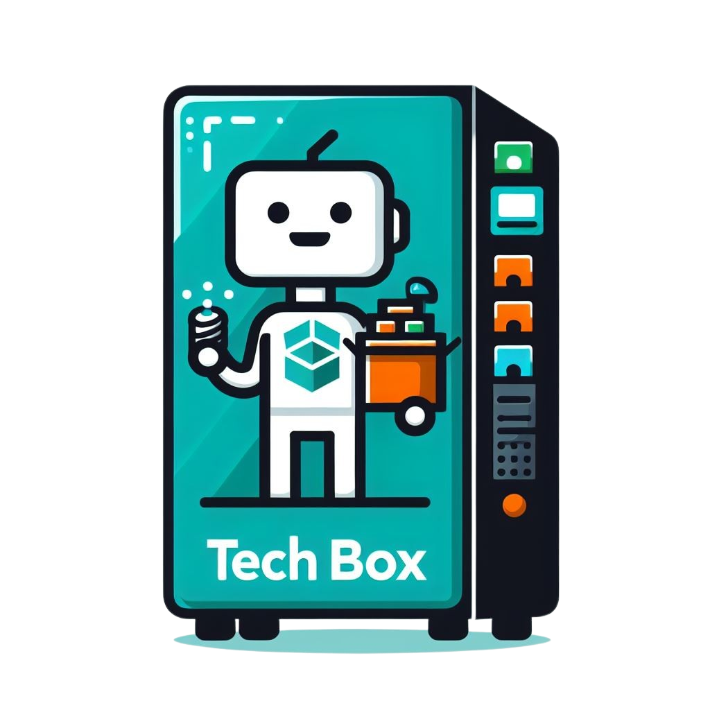

<h1 align="center" id="title">TechBox - Mobile</h1>

  

TechBox is a project that is composed by a website, mobile app and a prototype of a vending machine to do loans of material by an automatic way without intermediaries. The Mobile App is the part of the project which is directed to the users who are going to made loans or devolutions.

<h2>🚀 Demo</h2>

  
   
  
  

<h2>🧐 Characteristics</h2>

*   Intuitive and clean UI/UX
*   Safest QR code login
*   Loan history
  
<h2>💻 Made with</h2>

*   React Native
*   CSS
*   JavaScript
*   Firebase Real Time Database and Authenticator

<h2>💖 Did you like the project?</h2>

 Know the creators:

<a href="https://github.com/Hgdv11">Hugo Chaparro<a>

<a href="https://github.com/aahpichardo">Angel Hernandez<a>

<a href="https://github.com/julioerives">Julio Erives<a>
 

<a href="https://github.com/SantiagerArmendariz">Santiago Armendariz<a>

<a href="https://github.com/julioerives/techBox" target="_blank">Click here to see the Website repository</a>

<a href="https://github.com/aahpichardo/techbox-microcontrolador" target="_blank">Click here to see the IoT repository</a>

